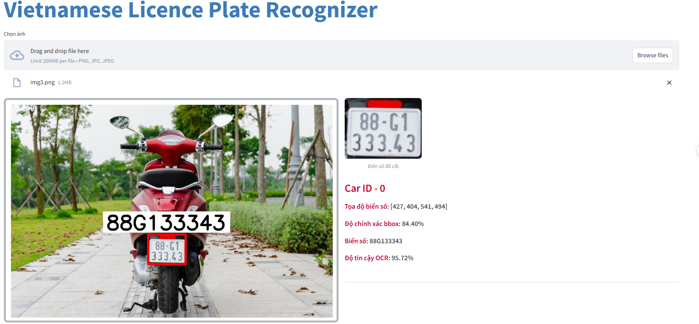

# Vietnamese License Plate Recognizer

This repository contains the source code for Project II (IT3930) course, with the topic of Vietnamese license plate recognition.

## Overview

This project develops a license plate recognition system using Deep Learning and Computer Vision techniques. The system utilizes:
- YOLOv11 model for vehicle and license plate detection in images.
- PaddleOCR library for character recognition from the detected license plate regions.
- Dataset [Vietnamese License Plate](https://universe.roboflow.com/school-fuhih/vietnamese-license-plate-tptd0) from Roboflow for model training.
- Streamlit framework to build a web-based user interface, making the system easy to interact with and test.
## Model Performance

| Model   | Precision | Recall    | mAP@0.5   | mAP@0.5:0.95 | Fitness   | Inference time (ms) |
|---------|-----------|-----------|-----------|---------------|-----------|---------------------|
| YOLO11n | 0.9952    | 0.9854    | 0.9947    | 0.7399        | 0.7652    | **0.855**           |
| YOLO11s | 0.9953    | 0.9878    | 0.9948    | 0.7484        | **0.7730**| 1.207               |
| YOLO11m | **0.9964**| 0.9845    | 0.9948    | 0.7446        | 0.7696    | 3.016               |
| YOLO11l | **0.9964**| 0.9845    | 0.9948    | 0.7446        | 0.7696    | 2.893               |
| YOLO11x | 0.9916    | **0.9901**| **0.9948**| **0.7454**     | 0.7704    | 6.908               |

Given the small scale of the project and the goal of running locally on personal machines, the YOLOv11n version was selected to balance between performance and inference speed.


## Dataset

The model was trained using the Vietnamese License Plate dataset available on Roboflow. This dataset includes images of motorbike and car license plates in Vietnam, captured from various angles and lighting conditions, allowing the model to learn diverse patterns and improve real-world recognition accuracy.

Dataset link: https://universe.roboflow.com/school-fuhih/vietnamese-license-plate-tptd0

## Installation

To run this project locally, follow these steps:

1. Clone the repository

```bash
git clone https://github.com/NguyenHoangXuanSon/VN-license-plate-recognizer.git
cd VN-license-plate-recognizer
```
2. Install the required libraries
   
```bash
pip install -r requirement.txt
```

3. Download the trained YOLOv11 model (either train your own or use a pre-trained version) and place it inside the models/ directory.

## Running the App

Once installation is complete, you can run the Streamlit app with the following command:

```bash
streamlit run app.py
```
## Sample Recognition Output




## Project Structure
- app.py: Main application file, handles UI and license plate recognition.
- main.py: Coordinates processing flow and invokes key functions.
- util.py: Contains helper functions for image and text processing.
- visualize.py: Module for drawing recognized plates on images.
- models/: Contains trained YOLOv11 model files.
- input/: Folder for input images or videos.
- output/: Folder to save processed results.
- requirement.txt: List of required libraries and their versions.
